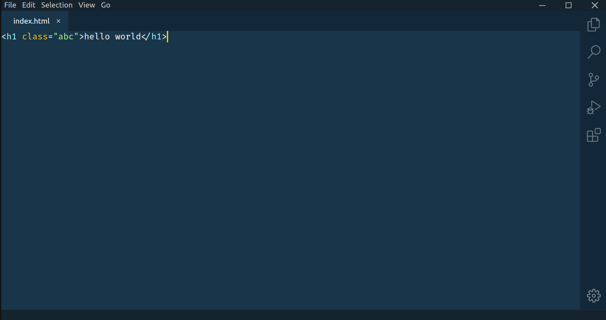

# Theme Cobalt2



## Contributing

```sh
git clone git@github.com:lvce-editor/theme-cobalt2.git &&
cd theme-cobalt2 &&
npm ci &&
npm run dev
```

## Gitpod

[](https://gitpod.io/#https://github.com/lvce-editor/theme-cobalt2)

## Credits

Extension is based on https://github.com/wesbos/cobalt2-vscode by @wesbos (License MIT)
